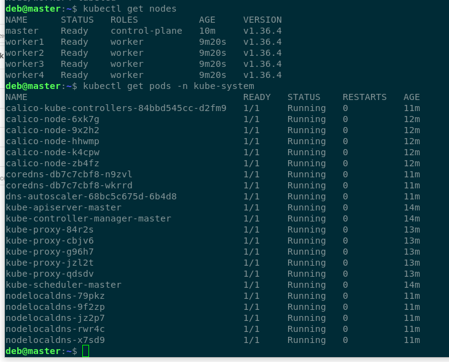
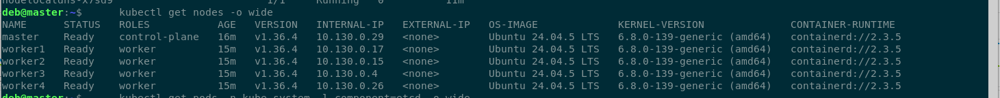
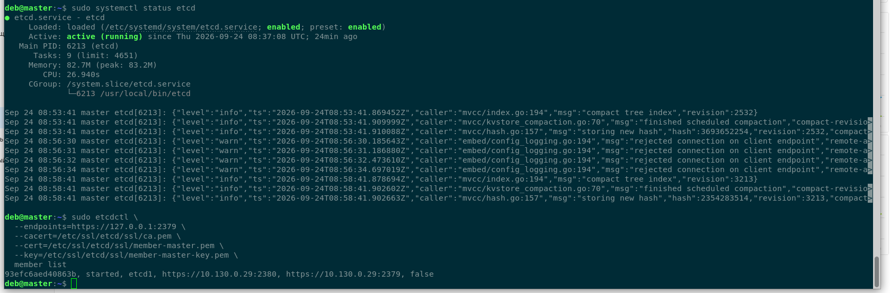
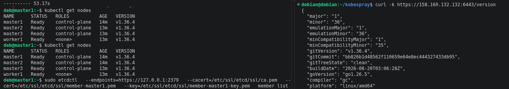
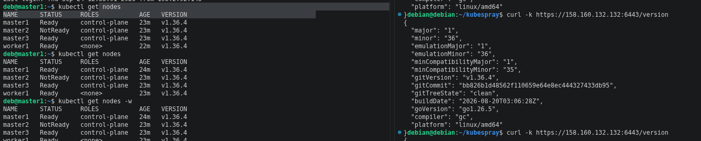

# kube_09
  
## Задание 1. Установить кластер k8s с 1 master node
  
Сервера созданы через terraform, далее через kubespray, единственно после установки необходимо настраивать внутри конфиг kubctl

### Terraform и ansible манифесты:
  
**[Манифесты](https://github.com/ufilin/kube_09/blob/main/task_1/)**  
  
### Скриншот  
  

  

  

  

## Задание 2*. Установить HA кластер

Сервера созданы через terraform, далее через kubespray

### Terraform и ansible манифесты:
  
**[Манифесты](https://github.com/ufilin/kube_09/blob/main/task_2/)**  
  
### Скриншоты

  

  
После выполнение команды shutdown на master2  
  

  

